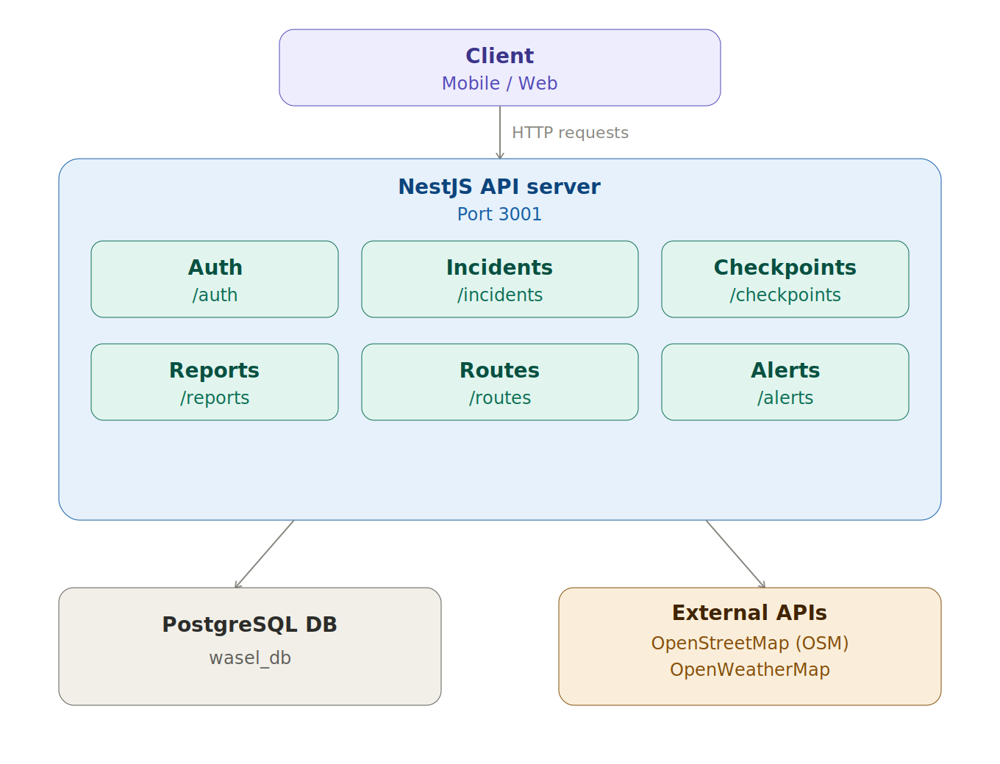
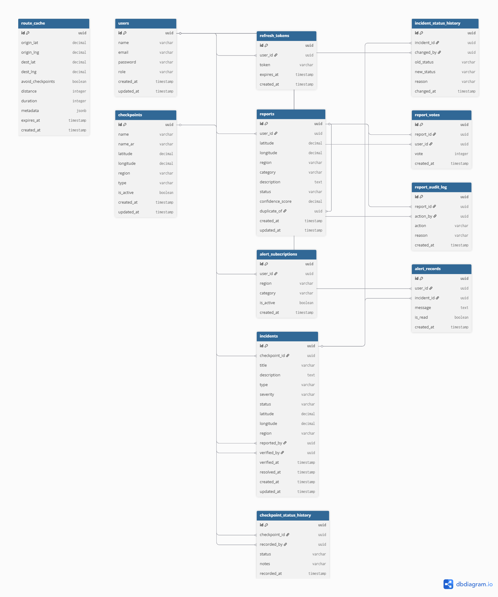
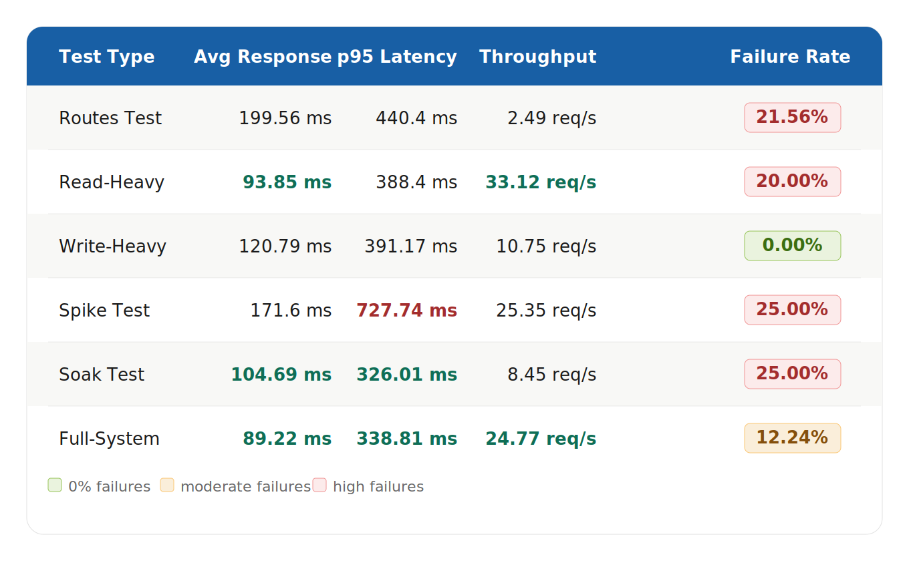

# Wasel Palestine
## Smart Mobility & Checkpoint Intelligence Platform

---

## System Overview
Wasel Palestine is a backend API platform designed to help Palestinians navigate daily movement challenges. It provides real-time mobility intelligence including checkpoints, road incidents, crowdsourced reports, route estimation, and automated alerts.

---

## Technology Stack

| Technology | Usage | Justification |
|------------|-------|---------------|
| Node.js + NestJS | Backend framework | Modular architecture, TypeScript support, built-in dependency injection, scalable and maintainable |
| PostgreSQL | Relational database | Reliable, supports complex queries, ACID compliance, ideal for structured mobility data |
| TypeORM | ORM for database management | Seamless PostgreSQL integration with NestJS, supports entity management and auto schema sync |
| JWT | Authentication (Access + Refresh tokens) | Stateless, secure, supports role-based access control without server-side session storage |
| OpenRouteService (OSM) | Routing and geolocation | Free, open-source, supports Palestinian territories unlike Google Maps |
| OpenWeatherMap | Weather data | Reliable REST API, provides real-time weather with minimal latency |
| Docker | Deployment | Ensures consistent environments across all team members and production |
| k6 | Performance testing | Lightweight, scriptable, supports load/stress/soak testing with detailed metrics |

---

## Architecture
- Modular RESTful API architecture
- Each feature is a separate NestJS module
- All endpoints versioned under `/api/v1/`
- JWT authentication with role-based access control (citizen, moderator, admin)
- PostgreSQL with TypeORM (ORM + raw queries)

---

## Architecture Diagram

---

## Database Schema (ERD)

### Authentication
| Table | Description |
|-------|-------------|
| users | System users with roles (citizen, moderator, admin) |
| refresh_tokens | JWT refresh token management |

### Checkpoints
| Table | Description |
|-------|-------------|
| checkpoints | Checkpoint registry with location data |
| checkpoint_status_history | History of checkpoint status changes |

### Incidents
| Table | Description |
|-------|-------------|
| incidents | Road incidents and hazards |
| incident_status_history | History of incident status changes |

### Reports
| Table | Description |
|-------|-------------|
| reports | Crowdsourced reports from citizens with confidence scoring |
| report_votes | Community voting to calculate confidence score |
| report_audit_log | Audit trail for all moderation actions |

### Alerts
| Table | Description |
|-------|-------------|
| alert_subscriptions | User alert subscriptions by region/category |
| alert_records | Generated alert records |

### Routes
| Table | Description |
|-------|-------------|
| route_cache | Cached route estimations (30 min expiry) |

---

## API Endpoints

### Authentication
| Method | Endpoint | Description | Auth |
|--------|----------|-------------|------|
| POST | /api/v1/auth/register | Register new user | Public |
| POST | /api/v1/auth/login | Login and get tokens | Public |
| POST | /api/v1/auth/logout | Logout | Required |

### Incidents
| Method | Endpoint | Description | Auth |
|--------|----------|-------------|------|
| GET | /api/v1/incidents | Get all incidents (filter, sort, paginate) | Public |
| GET | /api/v1/incidents/:id | Get incident by ID | Public |
| GET | /api/v1/incidents/:id/history | Get incident status history | Public |
| POST | /api/v1/incidents | Create incident | Admin/Moderator |
| PUT | /api/v1/incidents/:id | Update incident | Admin/Moderator |
| PATCH | /api/v1/incidents/:id/verify | Verify incident + trigger alerts | Admin/Moderator |
| PATCH | /api/v1/incidents/:id/close | Close incident | Admin/Moderator |
| PATCH | /api/v1/incidents/:id/resolve | Resolve incident | Admin/Moderator |
| DELETE | /api/v1/incidents/:id | Delete incident | Admin |

### Checkpoints
| Method | Endpoint | Description | Auth |
|--------|----------|-------------|------|
| GET | /api/v1/checkpoints | Get all checkpoints (filter, paginate) | Public |
| GET | /api/v1/checkpoints/:id | Get checkpoint by ID | Public |
| GET | /api/v1/checkpoints/:id/history | Get checkpoint status history | Public |
| POST | /api/v1/checkpoints | Create checkpoint | Admin/Moderator |
| PUT | /api/v1/checkpoints/:id | Update checkpoint | Admin/Moderator |
| DELETE | /api/v1/checkpoints/:id | Delete checkpoint | Admin |

### Reports
| Method | Endpoint | Description | Auth |
|--------|----------|-------------|------|
| POST | /api/v1/reports | Submit report | Required |
| GET | /api/v1/reports | Get all reports | Public |
| GET | /api/v1/reports/:id | Get report by ID | Public |
| GET | /api/v1/reports/:id/audit-log | Get report audit log | Required |
| PATCH | /api/v1/reports/:id/approve | Approve report | Admin/Moderator |
| PATCH | /api/v1/reports/:id/reject | Reject report | Admin/Moderator |
| PATCH | /api/v1/reports/:id/duplicate/:targetId | Mark report as duplicate | Admin/Moderator |
| POST | /api/v1/reports/:id/vote | Vote on report (updates confidence score) | Required |
| GET | /api/v1/reports/votes/all | Get all votes | Required |

### Alerts
| Method | Endpoint | Description | Auth |
|--------|----------|-------------|------|
| POST | /api/v1/alerts/subscriptions | Create alert subscription | Required |
| GET | /api/v1/alerts/subscriptions | Get my subscriptions | Required |
| DELETE | /api/v1/alerts/subscriptions/:id | Cancel subscription | Required |
| GET | /api/v1/alerts | Get my alerts (paginated) | Required |
| PATCH | /api/v1/alerts/:id/read | Mark alert as read | Required |

### Routes
| Method | Endpoint | Description | Auth |
|--------|----------|-------------|------|
| GET | /api/v1/routes/estimate | Estimate route with weather data | Public |

---

## External API Integrations

### OpenRouteService (OSM)
- **Endpoint:** `https://api.openrouteservice.org/v2/directions/driving-car/geojson`
- **Usage:** Calculates driving routes between two geographic coordinates
- **Returns:** distance (meters), duration (seconds), route coordinates
- **Timeout:** 5 seconds
- **Caching:** Results cached for 30 minutes to reduce external API calls
- **Supported constraints:** avoid_checkpoints, avoid_areas
- **Error handling:** Returns 503 if unavailable, 404 if no route found

### OpenWeatherMap
- **Endpoint:** `https://api.openweathermap.org/data/2.5/weather`
- **Usage:** Fetches real-time weather at route destination
- **Returns:** condition, temperature, humidity, wind speed, travel warning
- **Timeout:** 5 seconds
- **Automatic warnings for:** Thunderstorm, Rain, Snow, Fog, Drizzle
- **Error handling:** Returns 503 if unavailable

---

## Testing Strategy

All API endpoints were tested manually using Postman during development to verify correct HTTP status codes, request/response schemas, authentication behavior, and error handling.

Automated load testing was performed using k6 across the following scenarios:
- **Routes Test** — focuses on route estimation endpoint
- **Read-Heavy** — simulates high read traffic on listing endpoints
- **Write-Heavy** — simulates concurrent write operations (report submissions)
- **Spike Test** — tests system behavior under sudden traffic increases (max 20 VUs)
- **Soak Test** — extended 2-minute test to detect memory leaks and degradation
- **Full-System Test** — simulates mixed real-world usage

---

## Performance Testing Results

**Identified Bottleneck:** External routing API (OpenRouteService) caused most failures due to rate limiting and timeouts. Internal system remained stable throughout all tests with 0% failure rate on write operations.

**Root Causes:**
- External API rate limiting
- Network latency to external service
- External service timeout

**Optimizations Applied:**
- Route caching (30 minutes) — reduces repeated external API calls
- Timeout handling (5000ms) — prevents long waiting times
- Parallel API execution using Promise.all() — reduces total request processing time

 **Before/After Comparison:**
- Before caching: every route request called external API → avg 199ms with high failure rate
- After caching: repeated requests served locally → significantly reduced external API dependency and improved response time for cached routes
- Before Promise.all(): route and weather APIs called sequentially → higher total latency
- After Promise.all(): both APIs called in parallel → reduced processing time
---

## Running the Project

**Step 1:** Clone the repository
git clone https://github.com/saradaas01/Software-Project.git

**Step 2:** Install dependencies
npm install

**Step 3:** Create `.env` file
DB_HOST=localhost
DB_PORT=5432
DB_USERNAME=postgres
DB_PASSWORD=postgres
DB_NAME=wasel_db
JWT_SECRET=your_secret_key
ORS_API_KEY=your_openrouteservice_key
WEATHER_API_KEY=your_openweathermap_key

**Step 4:** Run the project
npm start

---

## Git Workflow
- One feature per branch
- Commit often with clear messages
- Always pull main before starting new work
- Never work directly on main
- At least one person must review before merging
- Delete branch after merging

---

## Team
| Dev | Feature | Extra |
|-----|---------|-------|
| Dev 1 (Layal) | Checkpoints + Incidents | Architecture docs + ERD |
| Dev 2 (Reem) | Reports | API-Dog all endpoints |
| Dev 3 (Waad) | Auth + Alerts + Docker | System overview + testing strategy |
| Dev 4 (Sara) | Routes + External APIs | k6 performance testing + report |